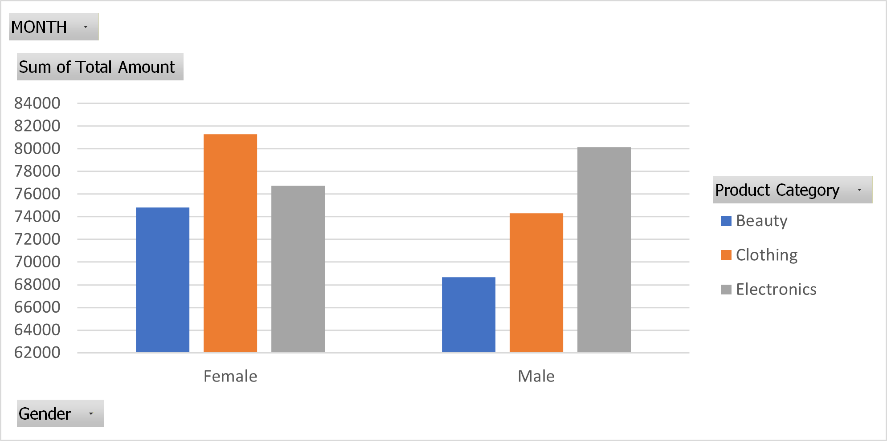

---

## Prepared By
**Sandy Moseru**

### Tools Used
- Microsoft Excel (Pivot Tables)
- Data Validation
- Trend Analysis

### Period Analyzed
- Year: 2023  
- Total Revenue: **456,000**

# Data Analysis Report: Consumer Spending by Gender and Product Category

## 1. Executive Summary
This report analyzes consumer spending patterns across Beauty, Clothing, and Electronics categories, segmented by gender. The findings highlight differences in purchasing behavior and provide actionable insights for marketing and product strategy.

**Key Highlights:**
- Females spent **52%** of the total (232,840), while males spent **48%** (223,160).
- Electronics is the largest category overall (**34% of total spend**).
- Females lead in Beauty and Clothing, while males lead in Electronics.

---

## 2. Data Overview
| Gender | Beauty | Clothing | Electronics | Grand Total |
|--------|--------|----------|-------------|-------------|
| Female | 74,830 | 81,275   | 76,735      | 232,840     |
| Male   | 68,685 | 74,305   | 80,170      | 223,160     |
| **Total** | **143,515** | **155,580** | **156,905** | **456,000** |

**Category Shares of Total Spend:**
- Beauty: 143,515 → **31%**
- Clothing: 155,580 → **34%**
- Electronics: 156,905 → **34%**

---

## 3. Key Findings
- **Overall Spending**: Females spent slightly more overall (**+4% compared to males**).
- **Category Leaders**:
  - Beauty: Females spent **52%**, males **48%**.
  - Clothing: Females spent **52%**, males **48%**.
  - Electronics: Males spent **51%**, females **49%**.
- **Top Category**: Electronics is the highest-spending category, accounting for **34% of total spend**.

---

## 4. Insights
- **Gender Preferences**:  
  - Females show stronger engagement in Beauty and Clothing.  
  - Males prioritize Electronics, reflecting higher interest in technology.  
- **Balanced Market**: Spending is evenly distributed across categories, with no extreme dominance.  
- **Strategic Implications**:  
  - Beauty & Clothing campaigns should emphasize female audiences.  
  - Electronics promotions should highlight male-oriented features, while still appealing to female buyers.  

---

## 5. Visualizations

### Spending by Gender and Category

---

## 6. Conclusion
Consumer spending is fairly balanced across categories, with gender-based preferences influencing category leadership. Businesses can leverage these insights to tailor marketing strategies, optimize product offerings, and enhance customer engagement.

